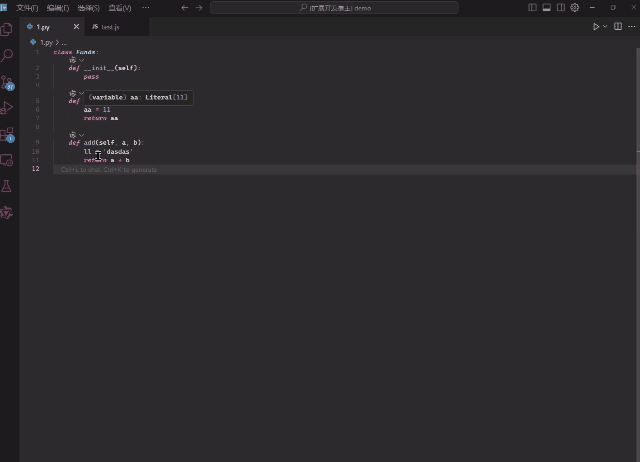

<!--
 * @Descripttion:
 * @version:
 * @Author: luckzhangfengbo
 * @Date: 2024-11-25 19:43:03
 * @LastEditors: zhangfengbo
 * @LastEditTime: 2024-11-25 20:55:56
-->



# Auto Logger Log

## Overview

**Auto Logger Log** is a VS Code extension designed to streamline the process of generating debug logs. It automatically generates print statements for selected variables, making it easier to log and debug code. The extension supports popular programming languages such as Java, Python, JavaScript, Go, and Rust.

Version supports a minimum of 1.70.0
---

## Key Features

### 🛠 Supported Languages

- **Java**: Generates `System.out.println` statements tailored to variable types.
- **Python**: Creates `print` statements for variables.
- **JavaScript/TypeScript**: Produces `console.log` statements for variables.
- **Go**: Supports the generation of `fmt.Println` log statements.
- **Rust**: Provides `println!` log macros.

### ⚙️ Detailed Features

1. **Smart Variable Handling**

   - Automatically detects variable types (strings, numbers, booleans, arrays, etc.).
   - Generates language-specific print statements for logging variables.

2. **Line Number Integration**

   - Logs the line number alongside the variable name for easy identification of where variables are used.

3. **Cross-Platform Compatibility**

   - Works out of the box without additional configuration.
   - Supports Windows, Linux, and macOS development environments.

4. **Customizability**
   - Shortcut keys are configurable to suit individual development preferences.

---

## How to Use

### 1️⃣ Install the Extension

1. Open VS Code.
2. Go to the Extensions Marketplace and search for **Auto Logger Log**.
3. Click **Install**.

### 2️⃣ Trigger the Shortcut

- Select a variable in your code.
- Press the default shortcut `Ctrl + Alt + P` (Windows/Linux) or `Cmd + Alt + P` (macOS).
- The extension will automatically insert a language-appropriate print statement below the selection.

### 3️⃣ Example

#### Input Code:

```js
const myVariable = 42;
const anotherVariable = "Hello";
// User selects `myVariable`
```

### Microsoft Offline Plugin Download Address

https://marketplace.visualstudio.com/items?itemName=zhangfengboLogger.AutoLogger&ssr=false#overview
